# **Proportional Streamflow Disaggregation Using Precipitation and Land Cover in disjoint hydrologic and hydraulic networks**

Our goal with this work is to develop a statistical downscaling method that can take predicted or observered streamflow and disaggregate it into its contributing components. Our method seeks to (1) Captures Real-Time Storm Dynamics, (2) model true river drainage and proportional flow distribution while (3) ensuring continuous downstream flow accumulation. For testing disaggregation methods, the following data sets and transformations were used.

## **Data:** 

### 1.  **Hydrofabric:** 

A hydrofabric (flowines, divides, flowpaths) was subset from the experimental v3.0 fabric at nwis gageID: '01183500'. 

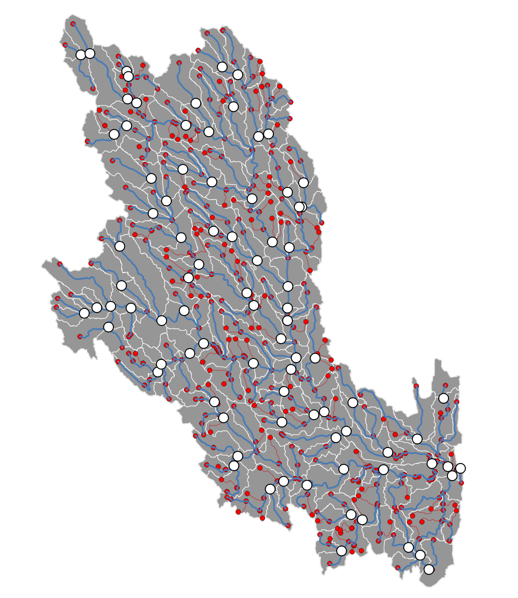

Source: [Lynker Spatial](https://www.lynker-spatial.com/)

### 2.  **Streamflow**

Daily streamflow data from ['2023-01-01'] to ['2023-12-31'] from the USGS were used for testing.

### 3.  **USGS National Land Cover Dataset (NLCD)**

|  |  |  |  |  |
|---------------|---------------|---------------|---------------|---------------|
| **Description** | **Anderson Level 1** | **Anderson Level 2** | **Level 1 Runoff Coefficient** | **Level 2 Runoff Coefficient** |
| Open Water  | 1 | 11 | 0.95 | 0.95 |
| Perennial Ice/Snow | 1 | 12 | 0.95 | 0.9 |
| Developed Open Space | 2 | 21 | 0.875 | 0.2 |
| Developed Low Intensity | 2 | 22 | 0.875 | 0.5 |
| Developed Medium Intensity | 2 | 23 | 0.875 | 0.75 |
| Developed High Intensity | 2 | 24 | 0.875 | 0.9 |
| Barren Land | 3 | 31 | 0.075 | 0.1 |
| Deciduous Forest | 4 | 41 | 0.2 | 0.2 |
| Evergreen forest | 4 | 42 | 0.2 | 0.25 |
| Mixed forest | 4 | 43 | 0.2 | 0.22 |
| Shrub/Scrub | 5 | 52 | 0.175 | 0.18 |
| Grassland | 7 | 71 | 0.175 | 0.35 |
| Pasture | 8 | 81 | 0.4 | 0.4 |
| Crops | 8 | 82 | 0.4 | 0.45 |
| Woody Wetlands | 9 | 90 | 0.125 | 0.15 |
| Herbaceous Wetlands | 9 | 95 | 0.125 | 0.1 |

Source: [2019 NLCD](https://www.mrlc.gov)

### 4.  **Precipitation data:** 

Average daily surface precipitation data (from Dayme v4 for 2023) was summarized to the incremental area of the hydrofabric.

Source: [Daymet v4](https://daymet.ornl.gov/)

### 5. **Soil Data:** 

30m POLARIS data was used to summarize average saturated hydraulic conductivity per incremental area in the hydrofabric.

Source: [POLARIS](http://hydrology.cee.duke.edu/POLARIS/)

## **Methods**

### **Incremental divides approach:** 

These methods disaggregate discharge with respect to the target incremental divide and not total upstream drainage.

#### **1. Area method**

$$
Qi(t) = Q_{nexus(t)} * \frac{A_i}{max(Aj)_j}
$$

where j iterates through all flowlines in the watershed.

#### **2. Area + Landcover based runoff coefficient:** 

$$
Qi(t) = Q_{nexus(t)} * \frac{A_i * Y_i}{max(A * Y)_j}
$$

Where:

-   $Q_{i(t)}$: Estimated flow from incremental area i at time

-   $Q_{nexus(t)}$: Observed or forecasted flow

-   $A_i$: Area of incremental area i

-   $Y_i$: Runoff yield modifier, based on land cover in i where

$$
Y_i = \sum_{l=1}^{L} f_{i,l} * y_l
$$

and

-   $f_{i,l}$: Fraction of land class lll in catchment i

-   $y_l$​: Runoff yield factor for land cover l, derived from long-term studies (in mm/day or normalized scale)

### **3. Area + Landcover based runoff coefficient + average rainfall**

$$
Qi(t) = Q_{nexus(t)} * \frac{A_i * Y_i * P_i}{max(A * Y * P)_j}
$$

Where:

-   $Q_{nexus(t)}$: streamflow at nexus (e.g., from NWM or observations)

-   $A_i$: area of catchment i (km²)

-   $P_i$: precipitation annual sum at catchment i

-   $Y_i$: **effective runoff coefficient** for catchment i

### **4. Area + Landcover based runoff coefficient + average rainfall + hydraulic conductivity**

$$
Qi(t) = Q_{nexus(t)} * \frac{A_i * \frac{1}{K_i} * P_i * Y_i}{max(A * \frac{1}{K} * Y * P)_j}
$$

Where:

-   $K_i$: Average hydraulic conductivity at catchment

### **5.  Area + Landcover based runoff coefficient + “realtime” rainfall + hydraulic conductivity**

Qi(t) = Qnexus(t) \* Aiɑ \* 1/Ki⍵\*Pi(t)Ɣ \* Ciβmax((Aɑ \* 1/K⍵\* P(t)Ɣ\*Cβ)j)

$$
Qi(t) = Q_{nexus(t)} * \frac{A^ɑ_i * \frac{1}{K^⍵_i} * P_i(t)^Ɣ * Y^β_i}{max(A^ɑ * \frac{1}{K^⍵} * P(t)^Ɣ * Y^β)_j}
$$

Where:

-   $P_i(t)$: precipitation at catchment i, time t (mm)

Also one can determine the degree of contribution of each through optimization using ɑ, β, ⍵, Ɣ parameters that range between 0-1. For example in watershed where runoff is dominated by rapid, event-based surface flow calibration would prioritize increasing Ɣ (precipitation)  and β(runoff coefficient) to amplify model ‘s response to storm magnitude and surface imperviousness. Conversely, in a system dominated by groundwater and sustained baseflow, optimization would focus on increasing ⍵ (hydraulic conductivity) and  ɑ (cumulative area) to emphasize the role of subsurface infiltration and storage in attenuating flood peaks and maintaining flow during dry periods.

Note: we have kept all values of the parameters to 1 and did not perform the optimization.

### **6-10. Methods 1-5 are repeated using total drainage area (DA) in place of incremental area (A)**

### **11. Drainage Area with travel time** 

This method disaggregates discharge with respect to the target total drainage area considering travel time through manning’s equation. Here we used most complex models involving K, P, C, and CA and incorporated travel time into calculation of flow disaggregation using manning’s equation: 

$$
T = sum(\frac{L}{\frac{1}{n} * R_h^\frac{2}{3} * S^\frac{1}{2}})
$$

$$
Q_{i, t} = Q_{nexus(t+T_i)} * W_i
$$

Where T is total travel time of a reach and W is the weight from the combination of K, P, C, and DA

### **12. Cumulative Area with travel time + seasonal precipitation:** 

This methods adds seasonal  precipitation weights (isolated to 2023). 

$$
P_{seasonal(i,s)} = \sum_{d in s} P_{daily(i, d)}
$$

where:

$P_{seasonal(i, s)}$ is the total precipitation for flowline i during season s.

$s$ represents one of the four seasons (e.g., 'Summer').

The summation Σ runs over all days d that fall within the season s.

$P_{daily(i, d)}$ is the daily precipitation for flowline i on day d.

$$
Unnormalized_{W_{i,s}} = \frac{A_i* Y_i * P_{seasonal_{i, s}}}{K_i}
$$

$$
{W_{seasonal_{(i,s)}}} = \frac{Unnormalized_{W_{i,s}}}{\sum_j Unnormalized_{W_{i,s}}}
$$

### **13. Cumulative Area with travel time + real time precipitation weights:**

Here, precipitation weights are calculated on a daily (timestep of streamflow) basis reflecting contributions of precipitation to total discharge on that particular date for target areas.

$$
Unnormalized_{W_{i,s}} = \frac{A_i * Y_i * P_{effective_{(i,d)}}}{K_i}
$$

$$
P_{effective_{(i,d)}} =
$$

$$
P_{(i,d)} if P_{(i,d)} > 0
$$

$$
PRECIP_{FLOOR} if P_{(i,d)} = 0
$$

## **Results:**

We found that cumulative area approaches better represent discharge disaggregation compared to the incremental area methods. We also found - in this basin - there was no advantage to using Level 2 land cover coefficents. Based on this, we reduced the 13 tested models to 5 key options increasing in complextity and data requirements. 

1- Cumulative area & Landcover

2- Model 1 + annual precipitation + travel time

3- Model 2 + hydraulic conductivity

4- Model 3 replaceing annual precipitation with real time precipitation

5- Weight adjusted Model 4

**Note**: The travel time methods rely on accurate estimates of manning roughness, channel dimensions, and slope values. Here we assumed the following constants for all reaches:

  - n = 0.1
  - Slope = 0.01
  - Channel dimension = a rectangular channel TW=5 and Y=2

Two forms of evaluation are used, visual animations of the basin, and a spot check at 2 upstream gage locations.The two stations evaluated are: '01179500', '01181000'

# Animations over 2023

## Model 1

## Model 2

## Model 3

## Model 4

## Model 5

# Upstream Gage Comparison

## Model 1
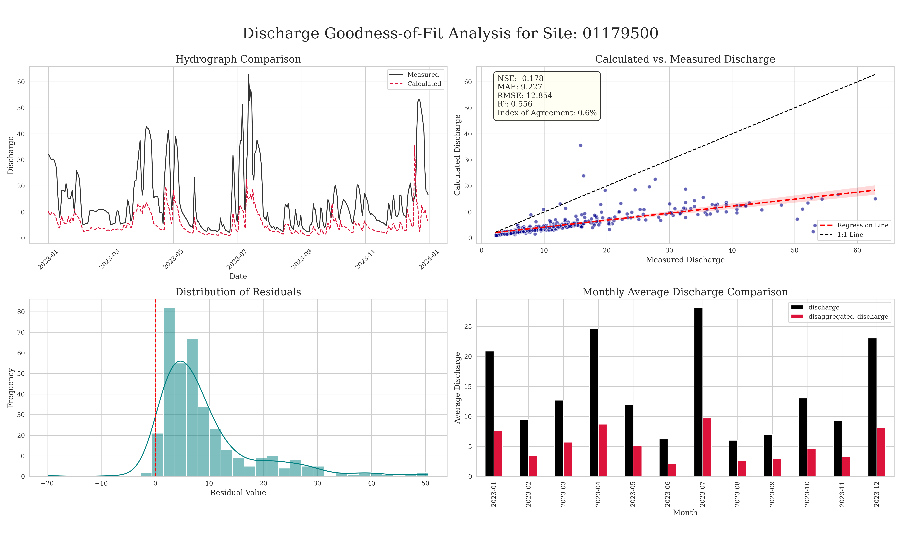
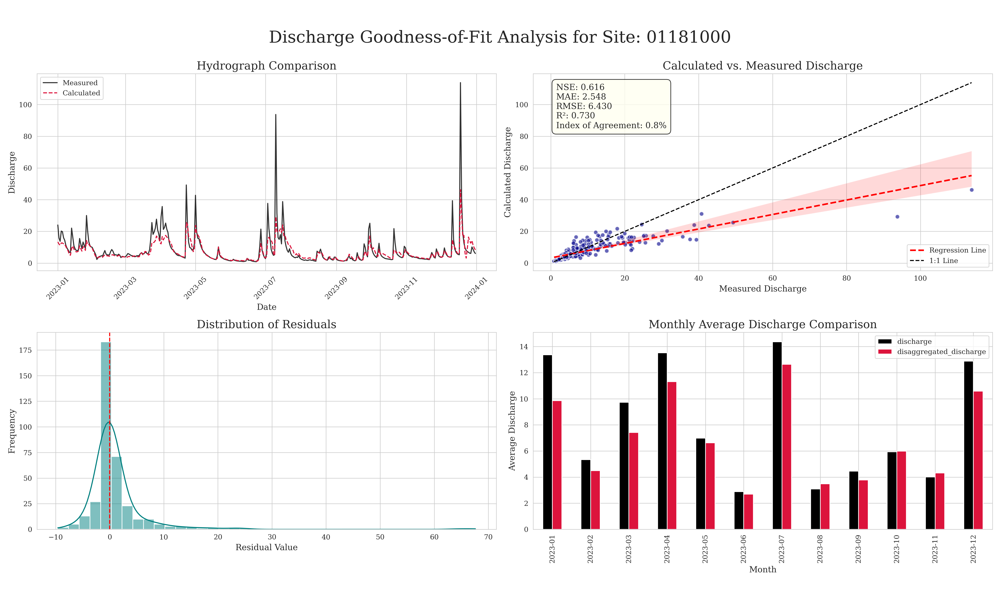

## Model 2
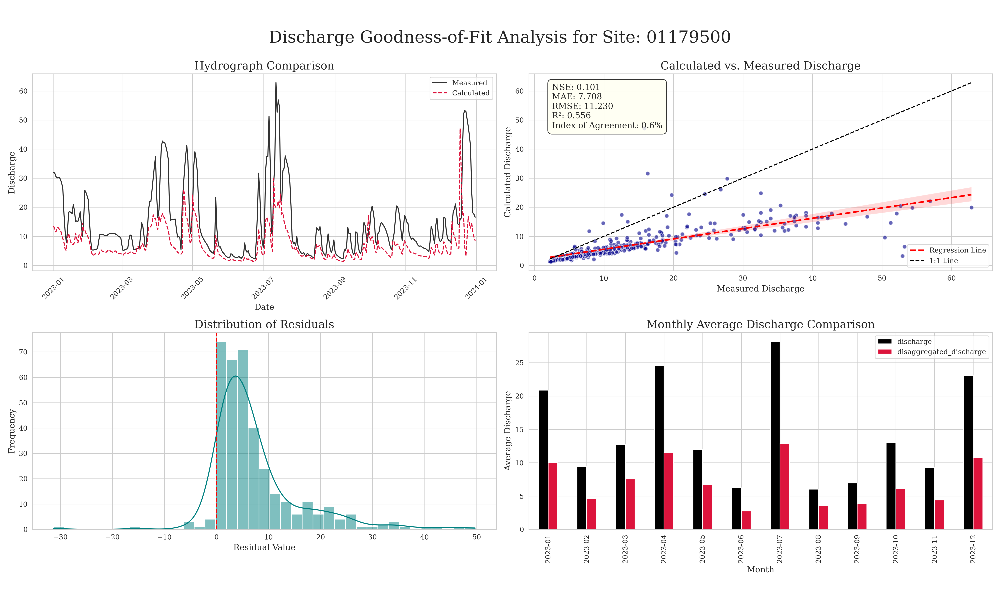
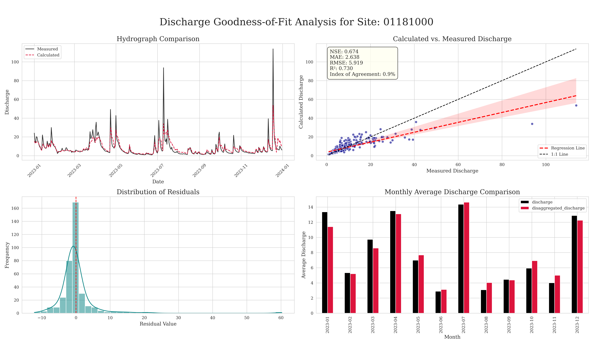

## Model 3
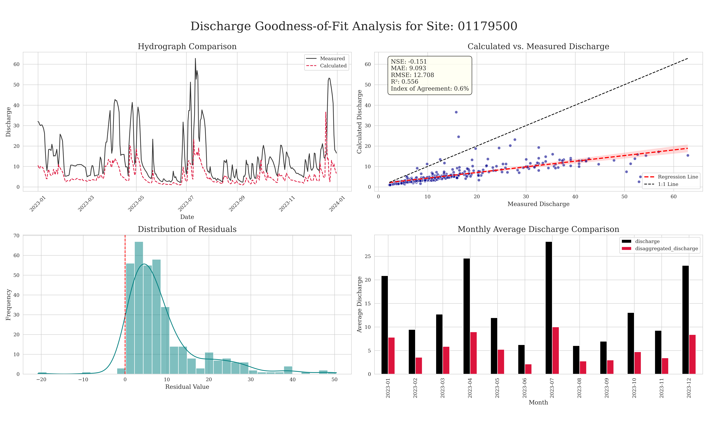
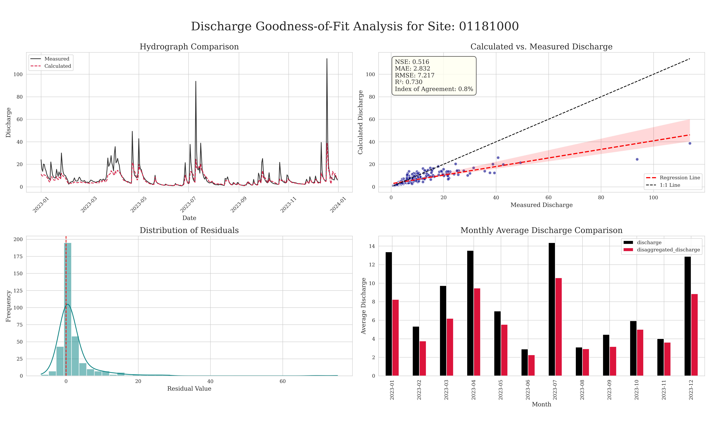

## Model 4
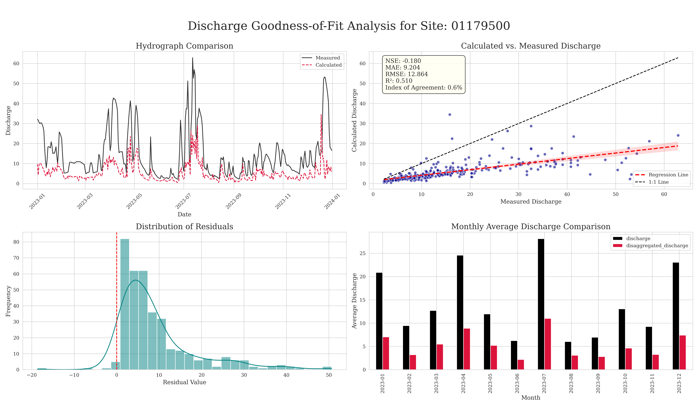
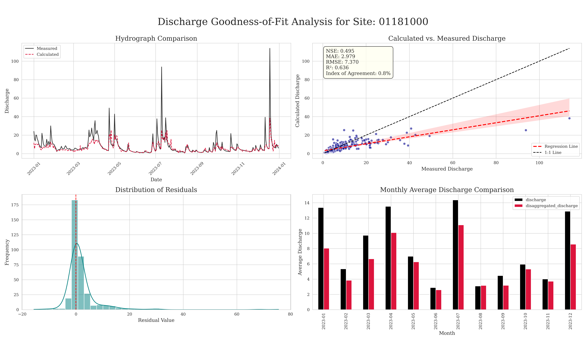

## Model 5

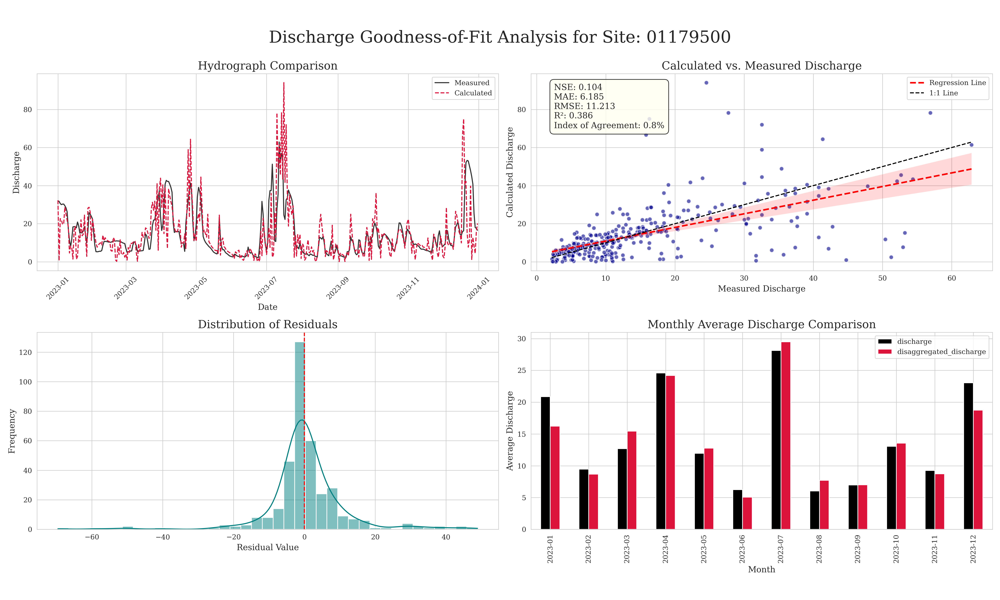
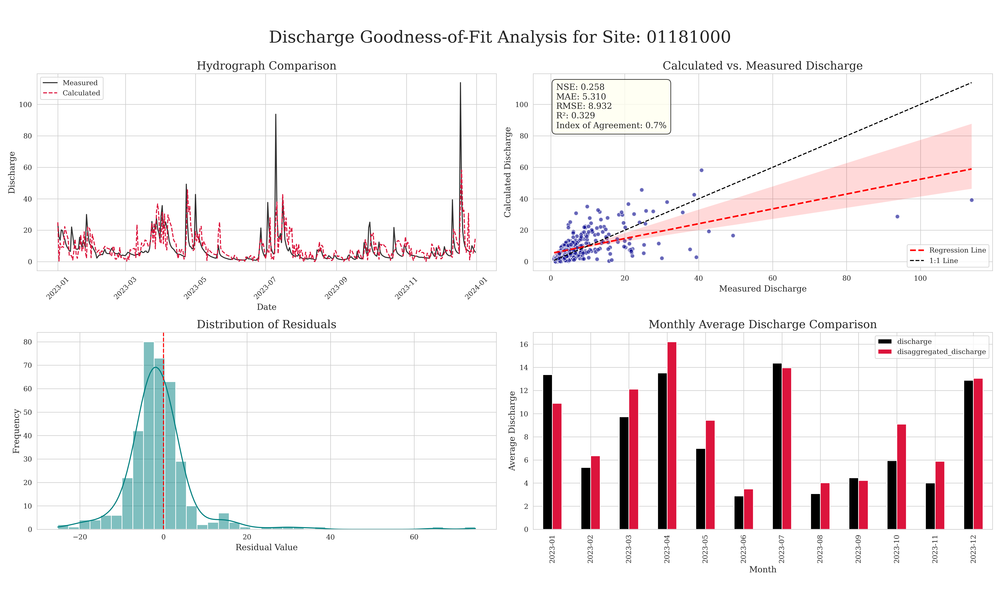

# Conclusion

With the caveats that:

1. This is prototype hydrofabric that is still dealing with non-dendritic flowlines
2. Only one year of rainfall data was used as a benchmark P
3. Best guesses for Landcover coefficients were used, with no optimization
4. We intentionally went with basic channels opposed to those accessible from [riverML](https://lynker-spatial.github.io/mip-riverml/)
5. We intentionally went with a statistics based approach opposed to trying to train and ML model or something more complex.
6. This is a single test site!

There is a lot of optimism to be had about this approach.

We found model 2 and 3 (adding static conductivity) strike a nice balance between complexity and performance, while model 4 (adding real-time precipitation) provides a more dynamic response to storm events. Model 5, which adjusts weights based on real-time precipitation, further enhances the model's ability to adapt to changing conditions.

Future work should look at 3 things: (1) extensability to other basins and (2) optimization of the parameters to improve performance (3) [decomposition of error into correlation and bias](https://agupubs.onlinelibrary.wiley.com/doi/full/10.1029/2023JD038534) to evaluate post processing methods for further refinement (hybrid model)

>>>>>>> archive/main
